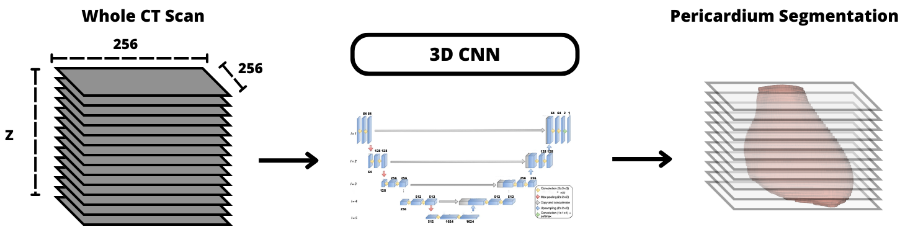

# 3D CT Automatic Pericardial Segmentation Using a Light Weight 3D CNN 

## Motivation

Segmentation of the heart in CT scans is highly valuable in clinical practice, as it enables the segmentation and quantification of other critical structures, such as vessels, fats, and calcifications. This, in turn, aids in monitoring and assessing the risk of cardiovascular diseases. The pericardium, a thin membranous sac that encases the heart, acts as a boundary between structures inside and outside the heart. Therefore, segmenting the pericardium could be particularly useful for examining internal heart structures. However, manually segmenting the pericardium proves to be a demanding and time consuming task, making it unsuitable for clinical settings. This has driven the development of automated segmentation methods. This study introduces an automated method for segmenting the pericardium in CT scans.

## Description

This work uses a lightweight 3D CNN capable of leveraging the 3D nature of computed tomography scans while having low memory requirements[^1].

## How to get ready?

- [Dataset Conversion](data)
- [Train the model](train)
- [Make predictions](predict)

## References

[^1]: R. Santos, R. Baeza, V. M. Filipe, F. Renna, H. Paredes and J. Pedrosa, "Lightweight 3D CNN for the Segmentation of Coronary Calcifications and Calcium Scoring," 2024 IEEE 22nd Mediterranean Electrotechnical Conference (MELECON), Porto, Portugal, 2024, pp. 346-351, doi: 10.1109/MELECON56669.2024.10608680.

